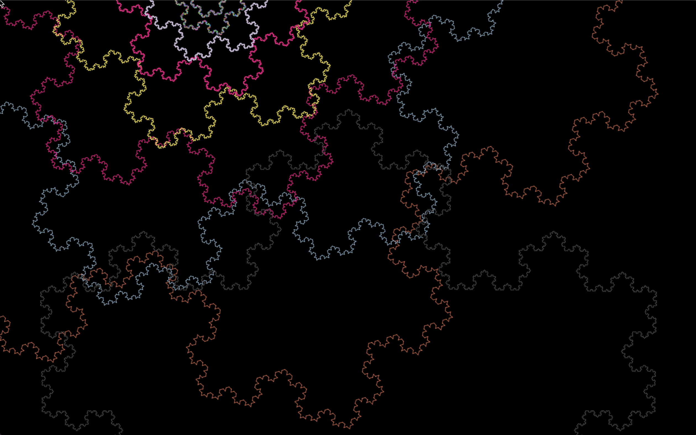

# Fractal Music Visualizer

This app takes a MIDI song file as input and uses Processing (an open source graphics library) to create a live visualization based on the notes in the song. It is inspired by the fractal properties of music and uses Koch snowflake fractals to explore the various aspects of each note including which note it is, which octave it is in, what velocity it is played with, and when it is played.

## Usage

To run, download the Processing IDE (https://processing.org/download/), open the included folder (fractalMusicVis), and either press play in the top left corner or press ctrl-R.

Note that you can change the song by editing the path to a song in line 35 of fractalMusicVis.pde:

```java
midiProc.load(dataPath("../music/songName.mid"));
```

For convenience, there are several MIDI song files included in the music folder.

## Examples

Below are some example images that a visualization might render.



